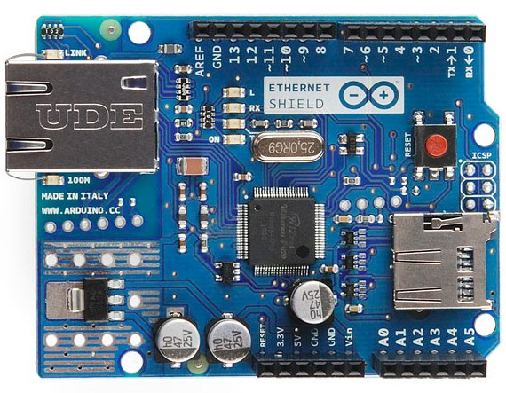
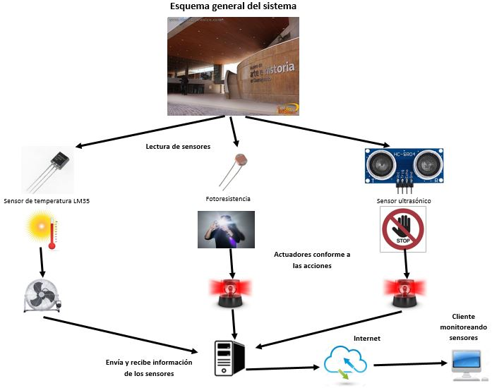
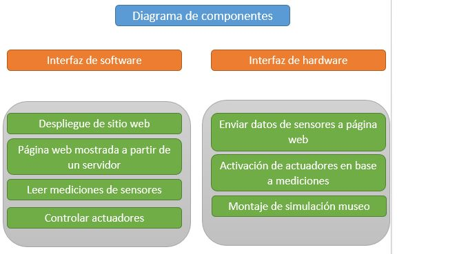


--------------------------------
#  Arduino Networking Museo

Autores
-------
* Ornelas Pérez Luis Saul
* Paniagua Soto Rafael
* Vallejo Herrera Juda Alector

### Problemática
Actualmente el Museo de Arte e Historia de Guanajuato cuenta con una exposición sobre la cultura Huasteca, en la cual se exhiben piezas de arte como pinturas y esculturas, en dónde algunas de ellas deben tener un cuidado más intensivo que otras. Dentro de la exhibición se encuentran estatuas de cera con los trajes típicos de la región, las cuales se busca proteger del flash de las cámaras, las temperaturas altas y que las personas no se acerquen más distancia de lo permitido. 

### Justificación
Teniendo obras de alto valor monetario se implementarán medidas de seguridad y prevención para el cuidado de las futuras exposiciones de artes para el Museo de Arte e Historia de Guanajuato. Buscando que cada visitante pueda disfrutar de su visita sin dañar o alterar las obras de artes expuestas se aplican sensores y actuadores para dar aviso de prevención al visitante de no acercarse o de avisar a los guardias de seguridad que se ha tomado una foto o además de eso saber si la temperatura del ambiente es la correcta para cada obra de arte. 

### Propuesta de solución
Los agentes de seguridad el Museo de Arte e Historia de Guanajuato tendrán la posibilidad de tener sensores, actuadores y página web para poder obtener información acerca de cada uno de los sensores y actuadores. El conjunto de sensores y actuadores que estén al cuidado de una obra de arte estarán en interacción con un microcontrolador y a su vez éste estará trabajando con un módulo Ethernet para tener conexión con nuestros dispositivos dentro de una red y de esa manera poder trabajar con ellos, de manera que cada dispositivo se pueda reportar por medio de una página web y con la misma poder apagar o prender un sensor.  

### Material necesario
* Placa Arduino UNO
* Placa Ethernet Shield W5100
* Conectores pin hembra-macho
* Conectores pin macho-macho
* Led RGB
* Resistencias varios valores
* Sensor ultrasónico 
* Sensor de luminosidad (fotoresistencia)
* Sensor temperatura LM35
* Buzzer
* Motor pequeño (Ventilador)
* Computadora laptop

### Software necesario
* Arduino IDE
* Navegador web

### Bibliotecas necesarias
* SPI
* Ethernet

### Puertos y protocolos de comunicación
* Puerto 80
* Protocolo HTTP

Especificaciones técnicas del equipo
------------------------------------
* Sistema Operativo: Ubuntu 16.04
* Procesador: AMD Radeon R2
* Memoria RAM: 8 GB

# Introducción a placa Ethernet Shield W5100
### Hardware Ethernet en Arduino
El Arduino Ethernet Shield nos da la capacidad de conectar un Arduino a una red Ethernet. Es la parte física que implementa la pila de protocolos TCP/IP.

Está basada en el chip ethernet Wiznet W5100. El Wiznet W5100 provee de una pila de red IP capaz de soportar TCP y UDP. Soporta hasta cuatro conexiones de sockets simultáneas. Usa la librería Ethernet para leer y escribir los flujos de datos que pasan por el puerto ethernet. Permite escribir sketches que se conecten a Internet o a una Intranet usando esta shield.

El shield provee un conector ethernet estándar RJ45. La ethernet shield dispone de unos conectores que permiten conectar a su vez otras placas encima y apilarlas sobre la placa Arduino.

### Hardware

### Conectividad
Soporta IPv4 y los protocolos TCP/UDP/HTTP/FTP

# Esquema general del sistema

# Diagrama de componentes

Resultados de la Práctica
-------------------------
### Armado del circuito y Montaje de la maqueta