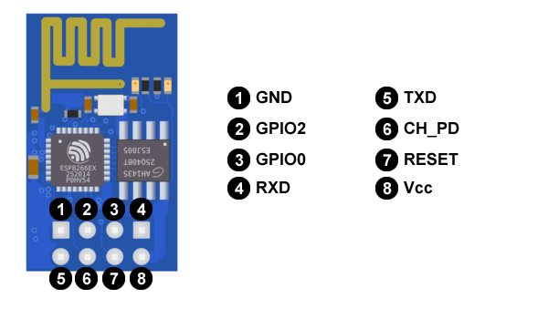

--------------------------------
#  Arduino Networking Museo

### Problemática
Dentro del Museo de Arte e Historia de Guanajuato existen piezas de arte como pinturas y esculturas, en dónde algunas de ellas deben tener un cuidado más intensivo que otras. Dentro de ello hay estatuas de cera las cuales se busca proteger de el flash de las cámaras, las temperaturas altas y que las personas no se acerquen más distancia de lo permitido. 

### Justificación
Teniendo obras de alto valor monetario se implementarán medidas de seguridad y prevención para el cuidado de las futuras exposiciones de artes para el Museo de Arte e Historia de Guanajuato. Buscando que cada visitante pueda disfrutar de su visita sin dañar o alterar las obras de artes expuestas se aplican sensores y actuadores para dar aviso de prevención al visitante de no acercarse o de avisar a los guardias de seguridad que se ha tomado una foto o además de eso saber si la temperatura del ambiente es la correcta para cada obra de arte. 

### Propuesta de solución
Los agentes de seguridad el Museo de Arte e Historia de Guanajuato tendrán la posibilidad de tener sensores, actuadores y página web para poder obtener información acerca de cada uno de los sensores y actuadores. El conjunto de sensores y actuadores que estén al cuidado de una obra de arte estarán en interacción con un microcontrolador y asu vez este estará trabajando con un módulo WIFI para tener conexión remota a nuestros dispositivos y de esa manera poder trabajar con ellos, de manera que cada dispositivo se pueda reportar por medio de una página web y con la misma poder apagar o prender un sensor.  

### Material necesario
* Placa arduino Elegoo
* Módulo WIFI ESP8266
* Conectores de para pin hembra-macho
* Conectores de para pin macho-macho
* Led de varios colores
* Resistencia de 10k
* Potenciometro 10k
* Sensor ultrasónico 
* Sensor de luminosidad (fotoresistencia)
* Sensor temperatur AM35
* Buzzer 
* Motor pequeño
* Computadora laptop

### Software necesario
* Arduino IDE
* Navegador web

### Bibliotecas necesarias
* ESP8266
* WIiFiClient
* ESP8266WebServer
* ESP8266mDNS
* SoftwareSerial

### Sistema operativo
* Aún no se que vayamos a poner.

# Introducción a placa ESP8266
Module wifi ESP8266
Repositorio : https://github.com/jalector/ESP8266

### Introducción a la problemática
Al intentar programar el módulo wifi ESP8266 desde el IDE Arduino, sin realizar ninguna configuración previa, lo más probable es que se presenten errores y falle la acción.
Algunos de los errores más comunes generados en este caso en el IDE Arduino son:
```shell
warning: espcomm_send_command: cant receive slip payload data
warning: espcomm_sync failed
error: espcomm_open failed
error: espcomm_upload_mem failed
```
Los cuales se presentan debido a que el microcontrolador del Arduino recibe las señales de programación, las cuales no son soportadas por el mismo, ya que las instrucciones enviadas son especiales para el módulo ESP8266 y no son soportadas por Arduino.

### Placa Wifi ESP8266
Tiene disponible dos pines GPIO digitales para controlar sensores y actuadores.
También se puede llegar a utilizar para este uso los pines Rx y Tx si no se utilizan para la comunicación a través del puerto serie. Se puede programar a través de un adaptador serie/USB o con el cableado adecuado, a través de Arduino. Los conectores que vienen por defecto, no permite conectarlo a la protoboard.
Esto dificulta prototipar con este módulo. Sin embargo, lo podemos usar como un dispositivo autónomo o como complemento con Arduino.
Especificaciones de la placa ESP8266-01

### Hardware
Introducción a la problemática
Utiliza una CPU Tensilica L106 32-bit
Voltaje de operación entre 3V y 3,6V
Corriente de operación 80 mA
Temperatura de operación -40ºC y 125ºC


### Conectividad
Soporta IPv4 y los protocolos TCP/UDP/HTTP/FTP

### Consumos
El consumo de energía dependerá de diferentes factores, como el modo en el que se esté trabajando, el ESP8266, de los protocolos que estemos utilizando, de los protocolos que estemos utilizando, de la calidad de la señal WiFi y sobre todo de sí enviamos o recibimos información a través de la WiFi. Oscilan entre los 0,5 μA (microamperios) cuando el dispositivo está apagado y los 170 mA cuando transmitimos a tope de señal.

## Diagrama de placa ESP8266-01


### Pines
1. Tierra (Conectada a la tierra de Arduino y si se tiene fuentes de alimentación externa, conectar tierra común).
2. Pin Digital usado para enviar o recibir señales como los pines de Arduino.
3. Pin Digital usado para enviar o recibir señales como los pines de Arduino. Además usado para activar modo de programación del módulo al conectarse a Tierra por medio de una resistencia de 10kOhms.
4. Pin de recepción de datos.
5. Pin de transmisión de datos.
6. Usado para prender y apagar el módulo al desconectar y volver a conectarlo a voltaje. 7. Siempre debe estar conectado. Recibe 3.3V (IMPORTANTE!!! No puede recibir más voltaje porque se puede quemar).
7. Usado para reiniciar el módulo al conectarlo y desconectarlo de Tierra.
8. Pin que recibe la corriente de voltaje 3.3V (IMPORTANTE!!! No puede recibir más voltaje porque se puede quemar).